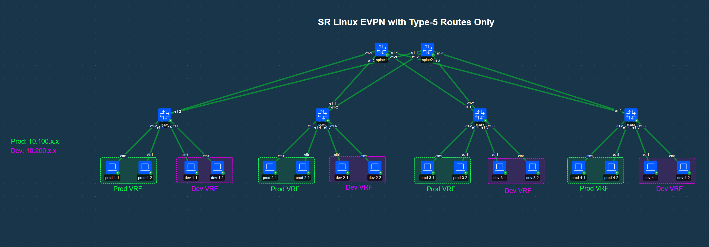

# SR Linux EVPN with Type-5 Routes Only

## Topology


## Lab Description
This lab demonstrates SR Linux EVPN using only IP Prefix (type-5) routes in a datacenter fabric. Two IP VRFs (`prod` and `dev`) are provisioned across the fabric and we have added two nodes to each leaf node in each VRF.

The host nodes in this lab run FRR and we are peering BGP to the host. All BGP peers are using IPv6 Unnumbered configurations.


## Containerlab Deployment

```
╭──────────┬──────────────────────────────┬─────────┬────────────────────╮
│   Name   │          Kind/Image          │  State  │   IPv4/6 Address   │
├──────────┼──────────────────────────────┼─────────┼────────────────────┤
│ dev-1-1  │ linux                        │ running │ 172.20.20.21       │
│          │ quay.io/frrouting/frr:10.6.1 │         │ 3fff:172:20:20::15 │
├──────────┼──────────────────────────────┼─────────┼────────────────────┤
│ dev-1-2  │ linux                        │ running │ 172.20.20.20       │
│          │ quay.io/frrouting/frr:10.6.1 │         │ 3fff:172:20:20::14 │
├──────────┼──────────────────────────────┼─────────┼────────────────────┤
│ dev-2-1  │ linux                        │ running │ 172.20.20.4        │
│          │ quay.io/frrouting/frr:10.6.1 │         │ 3fff:172:20:20::4  │
├──────────┼──────────────────────────────┼─────────┼────────────────────┤
│ dev-2-2  │ linux                        │ running │ 172.20.20.8        │
│          │ quay.io/frrouting/frr:10.6.1 │         │ 3fff:172:20:20::8  │
├──────────┼──────────────────────────────┼─────────┼────────────────────┤
│ dev-3-1  │ linux                        │ running │ 172.20.20.5        │
│          │ quay.io/frrouting/frr:10.6.1 │         │ 3fff:172:20:20::5  │
├──────────┼──────────────────────────────┼─────────┼────────────────────┤
│ dev-3-2  │ linux                        │ running │ 172.20.20.9        │
│          │ quay.io/frrouting/frr:10.6.1 │         │ 3fff:172:20:20::9  │
├──────────┼──────────────────────────────┼─────────┼────────────────────┤
│ dev-4-1  │ linux                        │ running │ 172.20.20.18       │
│          │ quay.io/frrouting/frr:10.6.1 │         │ 3fff:172:20:20::12 │
├──────────┼──────────────────────────────┼─────────┼────────────────────┤
│ dev-4-2  │ linux                        │ running │ 172.20.20.14       │
│          │ quay.io/frrouting/frr:10.6.1 │         │ 3fff:172:20:20::e  │
├──────────┼──────────────────────────────┼─────────┼────────────────────┤
│ leaf1    │ nokia_srlinux                │ running │ 172.20.20.22       │
│          │ ghcr.io/nokia/srlinux:26.3.2 │         │ 3fff:172:20:20::16 │
├──────────┼──────────────────────────────┼─────────┼────────────────────┤
│ leaf2    │ nokia_srlinux                │ running │ 172.20.20.3        │
│          │ ghcr.io/nokia/srlinux:26.3.2 │         │ 3fff:172:20:20::3  │
├──────────┼──────────────────────────────┼─────────┼────────────────────┤
│ leaf3    │ nokia_srlinux                │ running │ 172.20.20.19       │
│          │ ghcr.io/nokia/srlinux:26.3.2 │         │ 3fff:172:20:20::13 │
├──────────┼──────────────────────────────┼─────────┼────────────────────┤
│ leaf4    │ nokia_srlinux                │ running │ 172.20.20.23       │
│          │ ghcr.io/nokia/srlinux:26.3.2 │         │ 3fff:172:20:20::17 │
├──────────┼──────────────────────────────┼─────────┼────────────────────┤
│ prod-1-1 │ linux                        │ running │ 172.20.20.6        │
│          │ quay.io/frrouting/frr:10.6.1 │         │ 3fff:172:20:20::6  │
├──────────┼──────────────────────────────┼─────────┼────────────────────┤
│ prod-1-2 │ linux                        │ running │ 172.20.20.10       │
│          │ quay.io/frrouting/frr:10.6.1 │         │ 3fff:172:20:20::a  │
├──────────┼──────────────────────────────┼─────────┼────────────────────┤
│ prod-2-1 │ linux                        │ running │ 172.20.20.7        │
│          │ quay.io/frrouting/frr:10.6.1 │         │ 3fff:172:20:20::7  │
├──────────┼──────────────────────────────┼─────────┼────────────────────┤
│ prod-2-2 │ linux                        │ running │ 172.20.20.15       │
│          │ quay.io/frrouting/frr:10.6.1 │         │ 3fff:172:20:20::f  │
├──────────┼──────────────────────────────┼─────────┼────────────────────┤
│ prod-3-1 │ linux                        │ running │ 172.20.20.13       │
│          │ quay.io/frrouting/frr:10.6.1 │         │ 3fff:172:20:20::d  │
├──────────┼──────────────────────────────┼─────────┼────────────────────┤
│ prod-3-2 │ linux                        │ running │ 172.20.20.12       │
│          │ quay.io/frrouting/frr:10.6.1 │         │ 3fff:172:20:20::c  │
├──────────┼──────────────────────────────┼─────────┼────────────────────┤
│ prod-4-1 │ linux                        │ running │ 172.20.20.2        │
│          │ quay.io/frrouting/frr:10.6.1 │         │ 3fff:172:20:20::2  │
├──────────┼──────────────────────────────┼─────────┼────────────────────┤
│ prod-4-2 │ linux                        │ running │ 172.20.20.11       │
│          │ quay.io/frrouting/frr:10.6.1 │         │ 3fff:172:20:20::b  │
├──────────┼──────────────────────────────┼─────────┼────────────────────┤
│ spine1   │ nokia_srlinux                │ running │ 172.20.20.16       │
│          │ ghcr.io/nokia/srlinux:26.3.2 │         │ 3fff:172:20:20::10 │
├──────────┼──────────────────────────────┼─────────┼────────────────────┤
│ spine2   │ nokia_srlinux                │ running │ 172.20.20.17       │
│          │ ghcr.io/nokia/srlinux:26.3.2 │         │ 3fff:172:20:20::11 │
╰──────────┴──────────────────────────────┴─────────┴────────────────────╯
```

## Validation
### Host Validation
Each host advertises its loopback address and two /24 routes.

For Example host `prod-1-1` advertises:

- 10.1.1.1/32
- 10.100.10.0/24
- 10.100.11.0/24


Our validation will consist of pinging between loopback IP addresses of hosts in the same VRF as well as validating routing tables on the host.

#### Host Pings
You should only be able to ping between hosts within the same VRF of this lab. The loopback addresses assigned to each are:

| Host     | VRF           | Connected To | Loopback Address |
| -------- | ------------- | ------------ | ---------------- |
| prod-1-1 | prod          | leaf1        | 10.1.1.1         |
| prod-1-2 | prod          | leaf1        | 10.1.1.2         |
| prod-2-1 | prod          | leaf2        | 10.1.2.1         |
| prod-2-2 | prod          | leaf2        | 10.1.2.2         |
| prod-3-1 | prod          | leaf3        | 10.1.3.1         |
| prod-3-2 | prod          | leaf3        | 10.1.3.2         |
| prod-4-1 | prod          | leaf4        | 10.1.4.1         |
| prod-4-2 | prod          | leaf4        | 10.1.4.2         |
| dev-1-1  | dev           | leaf1        | 10.2.1.1         |
| dev-1-2  | dev           | leaf1        | 10.2.1.2         |
| dev-2-1  | dev           | leaf2        | 10.2.2.1         |
| dev-2-2  | dev           | leaf2        | 10.2.2.2         |
| dev-3-1  | dev           | leaf3        | 10.2.3.1         |
| dev-3-2  | dev           | leaf3        | 10.2.3.2         |
| dev-4-1  | dev           | leaf4        | 10.2.4.1         |
| dev-4-2  | dev           | leaf4        | 10.2.4.2         |


To ping log into the shell of one of the hosts:

``` bash
docker exec -it prod-1-1 bash
```

... And attempt to ping another host loopback:

``` bash
prod-1-1:/# ping -c 5 10.1.4.2
PING 10.1.4.2 (10.1.4.2): 56 data bytes
64 bytes from 10.1.4.2: seq=0 ttl=253 time=3.163 ms
64 bytes from 10.1.4.2: seq=1 ttl=253 time=1.796 ms
64 bytes from 10.1.4.2: seq=2 ttl=253 time=1.698 ms
64 bytes from 10.1.4.2: seq=3 ttl=253 time=2.310 ms
64 bytes from 10.1.4.2: seq=4 ttl=253 time=1.928 ms

--- 10.1.4.2 ping statistics ---
5 packets transmitted, 5 packets received, 0% packet loss
round-trip min/avg/max = 1.698/2.179/3.163 ms
```

#### Host Routing Tables

Log into the shell of one of the hosts:

``` bash
docker exec -it prod-1-1 bash
```

Enter into `vtysh`

```
prod-1-1:/# vtysh

Hello, this is FRRouting (version 10.6.1_git).
Copyright 1996-2005 Kunihiro Ishiguro, et al.

prod-1-1#
```

Run the `show ip route` command:

```
prod-1-1# show ip route
Codes: K - kernel route, C - connected, L - local, S - static,
       R - RIP, O - OSPF, I - IS-IS, B - BGP, E - EIGRP, N - NHRP,
       T - Table, v - VNC, V - VNC-Direct, A - Babel, F - PBR,
       f - OpenFabric, t - Table-Direct,
       > - selected route, * - FIB route, q - queued, r - rejected, b - backup
       t - trapped, o - offload failure

IPv4 unicast VRF default:
K>* 0.0.0.0/0 [0/0] via 172.20.20.1, eth0, weight 1, 00:18:34
L * 10.1.1.1/32 is directly connected, lo, weight 1, 00:18:33
C>* 10.1.1.1/32 is directly connected, lo, weight 1, 00:18:33
B>* 10.1.1.2/32 [20/0] via fe80::18d4:8ff:feff:3, eth1, weight 1, 00:17:14
B>* 10.1.2.1/32 [20/0] via fe80::18d4:8ff:feff:3, eth1, weight 1, 00:17:14
B>* 10.1.2.2/32 [20/0] via fe80::18d4:8ff:feff:3, eth1, weight 1, 00:17:14
B>* 10.1.3.1/32 [20/0] via fe80::18d4:8ff:feff:3, eth1, weight 1, 00:17:14
B>* 10.1.3.2/32 [20/0] via fe80::18d4:8ff:feff:3, eth1, weight 1, 00:17:14
B>* 10.1.4.1/32 [20/0] via fe80::18d4:8ff:feff:3, eth1, weight 1, 00:17:14
B>* 10.1.4.2/32 [20/0] via fe80::18d4:8ff:feff:3, eth1, weight 1, 00:17:14
S>* 10.100.10.0/24 [1/0] unreachable (blackhole), weight 1, 00:18:33
S>* 10.100.11.0/24 [1/0] unreachable (blackhole), weight 1, 00:18:33
B>* 10.100.20.0/24 [20/0] via fe80::18d4:8ff:feff:3, eth1, weight 1, 00:17:14
B>* 10.100.21.0/24 [20/0] via fe80::18d4:8ff:feff:3, eth1, weight 1, 00:17:14
B>* 10.100.30.0/24 [20/0] via fe80::18d4:8ff:feff:3, eth1, weight 1, 00:17:14
B>* 10.100.31.0/24 [20/0] via fe80::18d4:8ff:feff:3, eth1, weight 1, 00:17:14
B>* 10.100.40.0/24 [20/0] via fe80::18d4:8ff:feff:3, eth1, weight 1, 00:17:14
B>* 10.100.41.0/24 [20/0] via fe80::18d4:8ff:feff:3, eth1, weight 1, 00:17:14
C>* 172.20.20.0/24 is directly connected, eth0, weight 1, 00:18:34
L>* 172.20.20.6/32 is directly connected, eth0, weight 1, 00:18:34
prod-1-1#
```


### Underlay BGP Neighbors

```
A:root@leaf1# show network-instance default protocols bgp neighbor
-------------------------------------------------------------------------------------------------------------------------------------------------------------------------------------------------------------------------------------
BGP neighbor summary for network-instance "default"
Peer flags: see legend after the summary when applicable.
-------------------------------------------------------------------------------------------------------------------------------------------------------------------------------------------------------------------------------------
-------------------------------------------------------------------------------------------------------------------------------------------------------------------------------------------------------------------------------------
+------------------------+------------------------------------+------------------------+--------+-------------+--------------------+--------------------+----------------------------------------------------+
|        Net-Inst        |                Peer                |         Group          | Flags  |   Peer-AS   |       State        |       Uptime       |              AFI/SAFI [Rx/Active/Tx]               |
+========================+====================================+========================+========+=============+====================+====================+====================================================+
| default                | fe80::1870:15ff:feff:1%ethernet-   | ebgp-evpn              | D      | 100         | established        | 0d:0h:7m:26s       | evpn [24/0/32]                                     |
|                        | 1/2.0                              |                        |        |             |                    |                    | ipv4-unicast [4/4/5]                               |
| default                | fe80::1886:14ff:feff:1%ethernet-   | ebgp-evpn              | D      | 100         | established        | 0d:0h:7m:27s       | evpn [24/24/8]                                     |
|                        | 1/1.0                              |                        |        |             |                    |                    | ipv4-unicast [4/4/2]                               |
+------------------------+------------------------------------+------------------------+--------+-------------+--------------------+--------------------+----------------------------------------------------+
-------------------------------------------------------------------------------------------------------------------------------------------------------------------------------------------------------------------------------------
Summary:
0 configured neighbors, 0 configured sessions are established, 0 disabled peers
2 dynamic peers
-------------------------------------------------------------------------------------------------------------------------------------------------------------------------------------------------------------------------------------
Peer flag legend:
  D   Dynamic neighbor
```

### VRF BGP Neighbors
```
A:root@leaf1# show network-instance prod protocols bgp neighbor
-------------------------------------------------------------------------------------------------------------------------------------------------------------------------------------------------------------------------------------
BGP neighbor summary for network-instance "prod"
Peer flags: see legend after the summary when applicable.
-------------------------------------------------------------------------------------------------------------------------------------------------------------------------------------------------------------------------------------
-------------------------------------------------------------------------------------------------------------------------------------------------------------------------------------------------------------------------------------
+------------------------+------------------------------------+------------------------+--------+-------------+--------------------+--------------------+----------------------------------------------------+
|        Net-Inst        |                Peer                |         Group          | Flags  |   Peer-AS   |       State        |       Uptime       |              AFI/SAFI [Rx/Active/Tx]               |
+========================+====================================+========================+========+=============+====================+====================+====================================================+
| prod                   | fe80::a8c1:abff:fe67:932c%ethernet | hosts                  | D      | 65100       | established        | 0d:0h:8m:15s       | ipv4-unicast [16/1/15]                             |
|                        | -1/4.0                             |                        |        |             |                    |                    |                                                    |
| prod                   | fe80::a8c1:abff:febc:594e%ethernet | hosts                  | D      | 65100       | established        | 0d:0h:8m:15s       | ipv4-unicast [16/3/13]                             |
|                        | -1/3.0                             |                        |        |             |                    |                    |                                                    |
+------------------------+------------------------------------+------------------------+--------+-------------+--------------------+--------------------+----------------------------------------------------+
-------------------------------------------------------------------------------------------------------------------------------------------------------------------------------------------------------------------------------------
Summary:
0 configured neighbors, 0 configured sessions are established, 0 disabled peers
2 dynamic peers
-------------------------------------------------------------------------------------------------------------------------------------------------------------------------------------------------------------------------------------
Peer flag legend:
  D   Dynamic neighbor
```


### Underlay Routing Table

```
A:root@leaf1# show network-instance default ipv4 route
=====================================================================================================================================================================================================================================
IPv4-unicast route table for default network-instance
-------------------------------------------------------------------------------------------------------------------------------------------------------------------------------------------------------------------------------------
Flags: > (best), * (unviable), ! (failed)
     : L (leaked route from another network-instance)
     : B (backup NHG active and displayed)
     : S (statistics supported)
     : D (dynamic LB), R (resilient LB)
-------------------------------------------------------------------------------------------------------------------------------------------------------------------------------------------------------------------------------------
Prefix               Route Type   Metric   Pref    Flags    Next-Hop(s)
-------------------------------------------------------------------------------------------------------------------------------------------------------------------------------------------------------------------------------------
2.2.2.2/32           bgp          0        170     >        fe80::1886:14ff:feff:1(ethernet-1/1.0)                                                                                                                               
                                                            fe80::1870:15ff:feff:1(ethernet-1/2.0)
3.3.3.3/32           bgp          0        170     >        fe80::1886:14ff:feff:1(ethernet-1/1.0)                                                                                                                               
                                                            fe80::1870:15ff:feff:1(ethernet-1/2.0)
4.4.4.4/32           bgp          0        170     >        fe80::1886:14ff:feff:1(ethernet-1/1.0)                                                                                                                               
                                                            fe80::1870:15ff:feff:1(ethernet-1/2.0)
10.10.10.10/32       bgp          0        170     >        fe80::1886:14ff:feff:1(ethernet-1/1.0)
20.20.20.20/32       bgp          0        170     >        fe80::1870:15ff:feff:1(ethernet-1/2.0)
```

### VRF Routing Tables

```
A:root@leaf1# show network-instance prod ipv4 route
=====================================================================================================================================================================================================================================
IPv4-unicast route table for ip-vrf network-instance: prod
-------------------------------------------------------------------------------------------------------------------------------------------------------------------------------------------------------------------------------------
Flags: > (best), * (unviable), ! (failed)
     : L (leaked route from another network-instance)
     : B (backup NHG active and displayed)
     : S (statistics supported)
     : D (dynamic LB), R (resilient LB)
-------------------------------------------------------------------------------------------------------------------------------------------------------------------------------------------------------------------------------------
Prefix               Route Type   Metric   Pref    Flags    Next-Hop(s)
-------------------------------------------------------------------------------------------------------------------------------------------------------------------------------------------------------------------------------------
10.1.1.1/32          bgp          0        170     >        fe80::a8c1:abff:febc:594e(ethernet-1/3.0)
10.1.1.2/32          bgp          0        170     >        fe80::a8c1:abff:fe67:932c(ethernet-1/4.0)
10.1.2.1/32          bgp-evpn     0        170     >        2.2.2.2(tunnel:vxlan, vni:10000)
10.1.2.2/32          bgp-evpn     0        170     >        2.2.2.2(tunnel:vxlan, vni:10000)
10.1.3.1/32          bgp-evpn     0        170     >        3.3.3.3(tunnel:vxlan, vni:10000)
10.1.3.2/32          bgp-evpn     0        170     >        3.3.3.3(tunnel:vxlan, vni:10000)
10.1.4.1/32          bgp-evpn     0        170     >        4.4.4.4(tunnel:vxlan, vni:10000)
10.1.4.2/32          bgp-evpn     0        170     >        4.4.4.4(tunnel:vxlan, vni:10000)
10.100.10.0/24       bgp          0        170     >        fe80::a8c1:abff:febc:594e(ethernet-1/3.0)
10.100.11.0/24       bgp          0        170     >        fe80::a8c1:abff:febc:594e(ethernet-1/3.0)
10.100.20.0/24       bgp-evpn     0        170     >        2.2.2.2(tunnel:vxlan, vni:10000)
10.100.21.0/24       bgp-evpn     0        170     >        2.2.2.2(tunnel:vxlan, vni:10000)
10.100.30.0/24       bgp-evpn     0        170     >        3.3.3.3(tunnel:vxlan, vni:10000)
10.100.31.0/24       bgp-evpn     0        170     >        3.3.3.3(tunnel:vxlan, vni:10000)
10.100.40.0/24       bgp-evpn     0        170     >        4.4.4.4(tunnel:vxlan, vni:10000)
10.100.41.0/24       bgp-evpn     0        170     >        4.4.4.4(tunnel:vxlan, vni:10000)

--{ running }--[  ]--
```

### VXLAN Tunnel Table

```
A:root@leaf1# show tunnel-interface vxlan-interface brief
-------------------------------------------------------------------------------------------------------------------------------------------------------------------------------------------------------------------------------------
Show report for vxlan-tunnels 
-------------------------------------------------------------------------------------------------------------------------------------------------------------------------------------------------------------------------------------
+------------------+-----------------+--------+-------------+------------------+
| Tunnel Interface | VxLAN Interface |  Type  | Ingress VNI | Egress source-ip |
+==================+=================+========+=============+==================+
| vxlan0           | vxlan0.100      | routed | 10000       | 1.1.1.1/32       |
| vxlan0           | vxlan0.200      | routed | 20000       | 1.1.1.1/32       |
+------------------+-----------------+--------+-------------+------------------+
-------------------------------------------------------------------------------------------------------------------------------------------------------------------------------------------------------------------------------------
Summary
  1 tunnel-interfaces, 2 vxlan interfaces
  6 vxlan-destinations, 0 unicast, 0 es, 0 multicast, 6 ip
-------------------------------------------------------------------------------------------------------------------------------------------------------------------------------------------------------------------------------------

--{ running }--[  ]--
```

### EVPN Routes

In this lab we are demonstrating a layer-3 only EVPN within a data center with routing to the host which means this lab utilizes only type-5 EVPN routes.

```
A:root@leaf1# show network-instance protocols bgp routes evpn route-type summary
-------------------------------------------------------------------------------------------------------------------------------------------------------------------------------------------------------------------------------------
Show report for the BGP route table of network-instance "*"
-------------------------------------------------------------------------------------------------------------------------------------------------------------------------------------------------------------------------------------
Status codes: u=used, *=valid, >=best, x=stale, b=backup, w=unused-weight-only
Origin codes: i=IGP, e=EGP, ?=incomplete
-------------------------------------------------------------------------------------------------------------------------------------------------------------------------------------------------------------------------------------
BGP Router ID: 1.1.1.1      AS: 1      Local AS: 1
-------------------------------------------------------------------------------------------------------------------------------------------------------------------------------------------------------------------------------------
Type 5 IP Prefix Routes
+--------+----------------------------------+------------+---------------------+----------------------------------+--------+----------------------------------+----------------------------------+----------------------------------+
| Status |       Route-distinguisher        |   Tag-ID   |     IP-address      |             neighbor             | Path-  |             Next-Hop             |              Label               |             Gateway              |
|        |                                  |            |                     |                                  |   id   |                                  |                                  |                                  |
+========+==================================+============+=====================+==================================+========+==================================+==================================+==================================+
| *      | 2.2.2.2:10000                    | 0          | 10.100.20.0/24      | fe80::1870:15ff:feff:1%ethernet- | 0      | 2.2.2.2                          | 10000                            | 0.0.0.0                          |
|        |                                  |            |                     | 1/2.0                            |        |                                  |                                  |                                  |
| u*>    | 2.2.2.2:10000                    | 0          | 10.100.20.0/24      | fe80::1886:14ff:feff:1%ethernet- | 0      | 2.2.2.2                          | 10000                            | 0.0.0.0                          |
|        |                                  |            |                     | 1/1.0                            |        |                                  |                                  |                                  |
| *      | 2.2.2.2:10000                    | 0          | 10.100.21.0/24      | fe80::1870:15ff:feff:1%ethernet- | 0      | 2.2.2.2                          | 10000                            | 0.0.0.0                          |
|        |                                  |            |                     | 1/2.0                            |        |                                  |                                  |                                  |
| u*>    | 2.2.2.2:10000                    | 0          | 10.100.21.0/24      | fe80::1886:14ff:feff:1%ethernet- | 0      | 2.2.2.2                          | 10000                            | 0.0.0.0                          |
|        |                                  |            |                     | 1/1.0                            |        |                                  |                                  |                                  |
| *      | 2.2.2.2:10000                    | 0          | 10.1.2.1/32         | fe80::1870:15ff:feff:1%ethernet- | 0      | 2.2.2.2                          | 10000                            | 0.0.0.0                          |
|        |                                  |            |                     | 1/2.0                            |        |                                  |                                  |                                  |
| u*>    | 2.2.2.2:10000                    | 0          | 10.1.2.1/32         | fe80::1886:14ff:feff:1%ethernet- | 0      | 2.2.2.2                          | 10000                            | 0.0.0.0                          |
|        |                                  |            |                     | 1/1.0                            |        |                                  |                                  |                                  |
| *      | 2.2.2.2:10000                    | 0          | 10.1.2.2/32         | fe80::1870:15ff:feff:1%ethernet- | 0      | 2.2.2.2                          | 10000                            | 0.0.0.0                          |
|        |                                  |            |                     | 1/2.0                            |        |                                  |                                  |                                  |
| u*>    | 2.2.2.2:10000                    | 0          | 10.1.2.2/32         | fe80::1886:14ff:feff:1%ethernet- | 0      | 2.2.2.2                          | 10000                            | 0.0.0.0                          |
|        |                                  |            |                     | 1/1.0                            |        |                                  |                                  |                                  |
| *      | 2.2.2.2:20000                    | 0          | 10.200.20.0/24      | fe80::1870:15ff:feff:1%ethernet- | 0      | 2.2.2.2                          | 20000                            | 0.0.0.0                          |
|        |                                  |            |                     | 1/2.0                            |        |                                  |                                  |                                  |
| u*>    | 2.2.2.2:20000                    | 0          | 10.200.20.0/24      | fe80::1886:14ff:feff:1%ethernet- | 0      | 2.2.2.2                          | 20000                            | 0.0.0.0                          |
|        |                                  |            |                     | 1/1.0                            |        |                                  |                                  |                                  |
| *      | 2.2.2.2:20000                    | 0          | 10.200.21.0/24      | fe80::1870:15ff:feff:1%ethernet- | 0      | 2.2.2.2                          | 20000                            | 0.0.0.0                          |
|        |                                  |            |                     | 1/2.0                            |        |                                  |                                  |                                  |
| u*>    | 2.2.2.2:20000                    | 0          | 10.200.21.0/24      | fe80::1886:14ff:feff:1%ethernet- | 0      | 2.2.2.2                          | 20000                            | 0.0.0.0                          |
|        |                                  |            |                     | 1/1.0                            |        |                                  |                                  |                                  |
| *      | 2.2.2.2:20000                    | 0          | 10.2.2.1/32         | fe80::1870:15ff:feff:1%ethernet- | 0      | 2.2.2.2                          | 20000                            | 0.0.0.0                          |
|        |                                  |            |                     | 1/2.0                            |        |                                  |                                  |                                  |
| u*>    | 2.2.2.2:20000                    | 0          | 10.2.2.1/32         | fe80::1886:14ff:feff:1%ethernet- | 0      | 2.2.2.2                          | 20000                            | 0.0.0.0                          |
|        |                                  |            |                     | 1/1.0                            |        |                                  |                                  |                                  |
| *      | 2.2.2.2:20000                    | 0          | 10.2.2.2/32         | fe80::1870:15ff:feff:1%ethernet- | 0      | 2.2.2.2                          | 20000                            | 0.0.0.0                          |
|        |                                  |            |                     | 1/2.0                            |        |                                  |                                  |                                  |
| u*>    | 2.2.2.2:20000                    | 0          | 10.2.2.2/32         | fe80::1886:14ff:feff:1%ethernet- | 0      | 2.2.2.2                          | 20000                            | 0.0.0.0                          |
|        |                                  |            |                     | 1/1.0                            |        |                                  |                                  |                                  |
| *      | 3.3.3.3:10000                    | 0          | 10.100.30.0/24      | fe80::1870:15ff:feff:1%ethernet- | 0      | 3.3.3.3                          | 10000                            | 0.0.0.0                          |
|        |                                  |            |                     | 1/2.0                            |        |                                  |                                  |                                  |
| u*>    | 3.3.3.3:10000                    | 0          | 10.100.30.0/24      | fe80::1886:14ff:feff:1%ethernet- | 0      | 3.3.3.3                          | 10000                            | 0.0.0.0                          |
|        |                                  |            |                     | 1/1.0                            |        |                                  |                                  |                                  |
| *      | 3.3.3.3:10000                    | 0          | 10.100.31.0/24      | fe80::1870:15ff:feff:1%ethernet- | 0      | 3.3.3.3                          | 10000                            | 0.0.0.0                          |
|        |                                  |            |                     | 1/2.0                            |        |                                  |                                  |                                  |
| u*>    | 3.3.3.3:10000                    | 0          | 10.100.31.0/24      | fe80::1886:14ff:feff:1%ethernet- | 0      | 3.3.3.3                          | 10000                            | 0.0.0.0                          |
|        |                                  |            |                     | 1/1.0                            |        |                                  |                                  |                                  |
| *      | 3.3.3.3:10000                    | 0          | 10.1.3.1/32         | fe80::1870:15ff:feff:1%ethernet- | 0      | 3.3.3.3                          | 10000                            | 0.0.0.0                          |
|        |                                  |            |                     | 1/2.0                            |        |                                  |                                  |                                  |
| u*>    | 3.3.3.3:10000                    | 0          | 10.1.3.1/32         | fe80::1886:14ff:feff:1%ethernet- | 0      | 3.3.3.3                          | 10000                            | 0.0.0.0                          |
|        |                                  |            |                     | 1/1.0                            |        |                                  |                                  |                                  |
| *      | 3.3.3.3:10000                    | 0          | 10.1.3.2/32         | fe80::1870:15ff:feff:1%ethernet- | 0      | 3.3.3.3                          | 10000                            | 0.0.0.0                          |
|        |                                  |            |                     | 1/2.0                            |        |                                  |                                  |                                  |
| u*>    | 3.3.3.3:10000                    | 0          | 10.1.3.2/32         | fe80::1886:14ff:feff:1%ethernet- | 0      | 3.3.3.3                          | 10000                            | 0.0.0.0                          |
|        |                                  |            |                     | 1/1.0                            |        |                                  |                                  |                                  |
| *      | 3.3.3.3:20000                    | 0          | 10.200.30.0/24      | fe80::1870:15ff:feff:1%ethernet- | 0      | 3.3.3.3                          | 20000                            | 0.0.0.0                          |
|        |                                  |            |                     | 1/2.0                            |        |                                  |                                  |                                  |
| u*>    | 3.3.3.3:20000                    | 0          | 10.200.30.0/24      | fe80::1886:14ff:feff:1%ethernet- | 0      | 3.3.3.3                          | 20000                            | 0.0.0.0                          |
|        |                                  |            |                     | 1/1.0                            |        |                                  |                                  |                                  |
| *      | 3.3.3.3:20000                    | 0          | 10.200.31.0/24      | fe80::1870:15ff:feff:1%ethernet- | 0      | 3.3.3.3                          | 20000                            | 0.0.0.0                          |
|        |                                  |            |                     | 1/2.0                            |        |                                  |                                  |                                  |
| u*>    | 3.3.3.3:20000                    | 0          | 10.200.31.0/24      | fe80::1886:14ff:feff:1%ethernet- | 0      | 3.3.3.3                          | 20000                            | 0.0.0.0                          |
|        |                                  |            |                     | 1/1.0                            |        |                                  |                                  |                                  |
| *      | 3.3.3.3:20000                    | 0          | 10.2.3.1/32         | fe80::1870:15ff:feff:1%ethernet- | 0      | 3.3.3.3                          | 20000                            | 0.0.0.0                          |
|        |                                  |            |                     | 1/2.0                            |        |                                  |                                  |                                  |
| u*>    | 3.3.3.3:20000                    | 0          | 10.2.3.1/32         | fe80::1886:14ff:feff:1%ethernet- | 0      | 3.3.3.3                          | 20000                            | 0.0.0.0                          |
|        |                                  |            |                     | 1/1.0                            |        |                                  |                                  |                                  |
| *      | 3.3.3.3:20000                    | 0          | 10.2.3.2/32         | fe80::1870:15ff:feff:1%ethernet- | 0      | 3.3.3.3                          | 20000                            | 0.0.0.0                          |
|        |                                  |            |                     | 1/2.0                            |        |                                  |                                  |                                  |
| u*>    | 3.3.3.3:20000                    | 0          | 10.2.3.2/32         | fe80::1886:14ff:feff:1%ethernet- | 0      | 3.3.3.3                          | 20000                            | 0.0.0.0                          |
|        |                                  |            |                     | 1/1.0                            |        |                                  |                                  |                                  |
| *      | 4.4.4.4:10000                    | 0          | 10.100.40.0/24      | fe80::1870:15ff:feff:1%ethernet- | 0      | 4.4.4.4                          | 10000                            | 0.0.0.0                          |
|        |                                  |            |                     | 1/2.0                            |        |                                  |                                  |                                  |
| u*>    | 4.4.4.4:10000                    | 0          | 10.100.40.0/24      | fe80::1886:14ff:feff:1%ethernet- | 0      | 4.4.4.4                          | 10000                            | 0.0.0.0                          |
|        |                                  |            |                     | 1/1.0                            |        |                                  |                                  |                                  |
| *      | 4.4.4.4:10000                    | 0          | 10.100.41.0/24      | fe80::1870:15ff:feff:1%ethernet- | 0      | 4.4.4.4                          | 10000                            | 0.0.0.0                          |
|        |                                  |            |                     | 1/2.0                            |        |                                  |                                  |                                  |
| u*>    | 4.4.4.4:10000                    | 0          | 10.100.41.0/24      | fe80::1886:14ff:feff:1%ethernet- | 0      | 4.4.4.4                          | 10000                            | 0.0.0.0                          |
|        |                                  |            |                     | 1/1.0                            |        |                                  |                                  |                                  |
| *      | 4.4.4.4:10000                    | 0          | 10.1.4.1/32         | fe80::1870:15ff:feff:1%ethernet- | 0      | 4.4.4.4                          | 10000                            | 0.0.0.0                          |
|        |                                  |            |                     | 1/2.0                            |        |                                  |                                  |                                  |
| u*>    | 4.4.4.4:10000                    | 0          | 10.1.4.1/32         | fe80::1886:14ff:feff:1%ethernet- | 0      | 4.4.4.4                          | 10000                            | 0.0.0.0                          |
|        |                                  |            |                     | 1/1.0                            |        |                                  |                                  |                                  |
| *      | 4.4.4.4:10000                    | 0          | 10.1.4.2/32         | fe80::1870:15ff:feff:1%ethernet- | 0      | 4.4.4.4                          | 10000                            | 0.0.0.0                          |
|        |                                  |            |                     | 1/2.0                            |        |                                  |                                  |                                  |
| u*>    | 4.4.4.4:10000                    | 0          | 10.1.4.2/32         | fe80::1886:14ff:feff:1%ethernet- | 0      | 4.4.4.4                          | 10000                            | 0.0.0.0                          |
|        |                                  |            |                     | 1/1.0                            |        |                                  |                                  |                                  |
| *      | 4.4.4.4:20000                    | 0          | 10.200.40.0/24      | fe80::1870:15ff:feff:1%ethernet- | 0      | 4.4.4.4                          | 20000                            | 0.0.0.0                          |
|        |                                  |            |                     | 1/2.0                            |        |                                  |                                  |                                  |
| u*>    | 4.4.4.4:20000                    | 0          | 10.200.40.0/24      | fe80::1886:14ff:feff:1%ethernet- | 0      | 4.4.4.4                          | 20000                            | 0.0.0.0                          |
|        |                                  |            |                     | 1/1.0                            |        |                                  |                                  |                                  |
| *      | 4.4.4.4:20000                    | 0          | 10.200.41.0/24      | fe80::1870:15ff:feff:1%ethernet- | 0      | 4.4.4.4                          | 20000                            | 0.0.0.0                          |
|        |                                  |            |                     | 1/2.0                            |        |                                  |                                  |                                  |
| u*>    | 4.4.4.4:20000                    | 0          | 10.200.41.0/24      | fe80::1886:14ff:feff:1%ethernet- | 0      | 4.4.4.4                          | 20000                            | 0.0.0.0                          |
|        |                                  |            |                     | 1/1.0                            |        |                                  |                                  |                                  |
| *      | 4.4.4.4:20000                    | 0          | 10.2.4.1/32         | fe80::1870:15ff:feff:1%ethernet- | 0      | 4.4.4.4                          | 20000                            | 0.0.0.0                          |
|        |                                  |            |                     | 1/2.0                            |        |                                  |                                  |                                  |
| u*>    | 4.4.4.4:20000                    | 0          | 10.2.4.1/32         | fe80::1886:14ff:feff:1%ethernet- | 0      | 4.4.4.4                          | 20000                            | 0.0.0.0                          |
|        |                                  |            |                     | 1/1.0                            |        |                                  |                                  |                                  |
| *      | 4.4.4.4:20000                    | 0          | 10.2.4.2/32         | fe80::1870:15ff:feff:1%ethernet- | 0      | 4.4.4.4                          | 20000                            | 0.0.0.0                          |
|        |                                  |            |                     | 1/2.0                            |        |                                  |                                  |                                  |
| u*>    | 4.4.4.4:20000                    | 0          | 10.2.4.2/32         | fe80::1886:14ff:feff:1%ethernet- | 0      | 4.4.4.4                          | 20000                            | 0.0.0.0                          |
|        |                                  |            |                     | 1/1.0                            |        |                                  |                                  |                                  |
+--------+----------------------------------+------------+---------------------+----------------------------------+--------+----------------------------------+----------------------------------+----------------------------------+
-------------------------------------------------------------------------------------------------------------------------------------------------------------------------------------------------------------------------------------
0 Ethernet Auto-Discovery routes 0 used, 0 valid, 0 stale
0 MAC-IP Advertisement routes 0 used, 0 valid, 0 stale
0 Inclusive Multicast Ethernet Tag routes 0 used, 0 valid, 0 stale
0 Ethernet Segment routes 0 used, 0 valid, 0 stale
48 IP Prefix routes 24 used, 48 valid, 0 stale
0 Selective Multicast Ethernet Tag routes 0 used, 0 valid, 0 stale
0 Selective Multicast Membership Report Sync routes 0 used, 0 valid, 0 stale
0 Selective Multicast Leave Sync routes 0 used, 0 valid, 0 stale
-------------------------------------------------------------------------------------------------------------------------------------------------------------------------------------------------------------------------------------

--{ running }--[  ]--
```